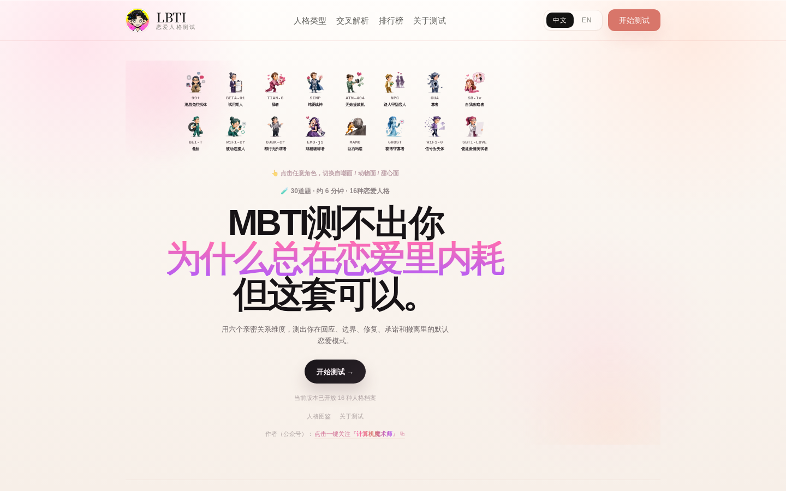
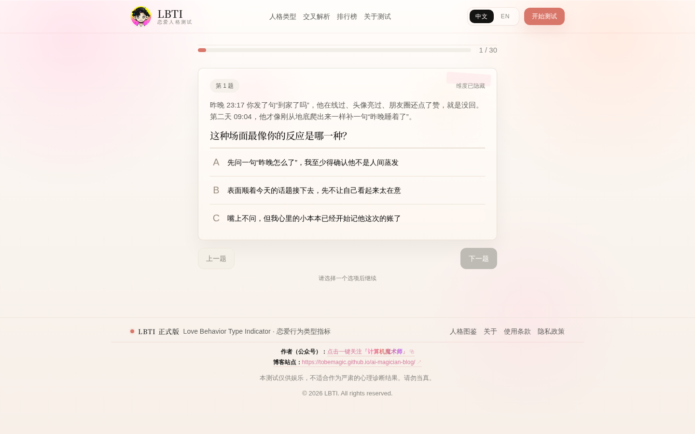
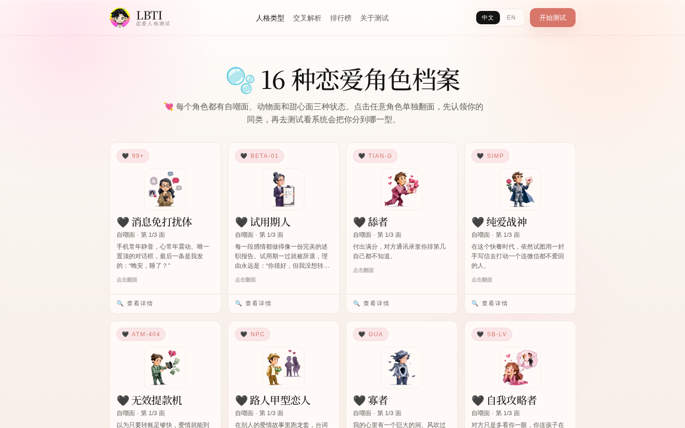
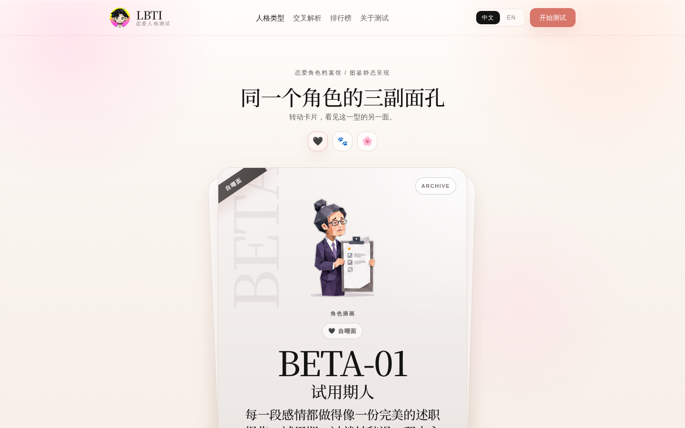
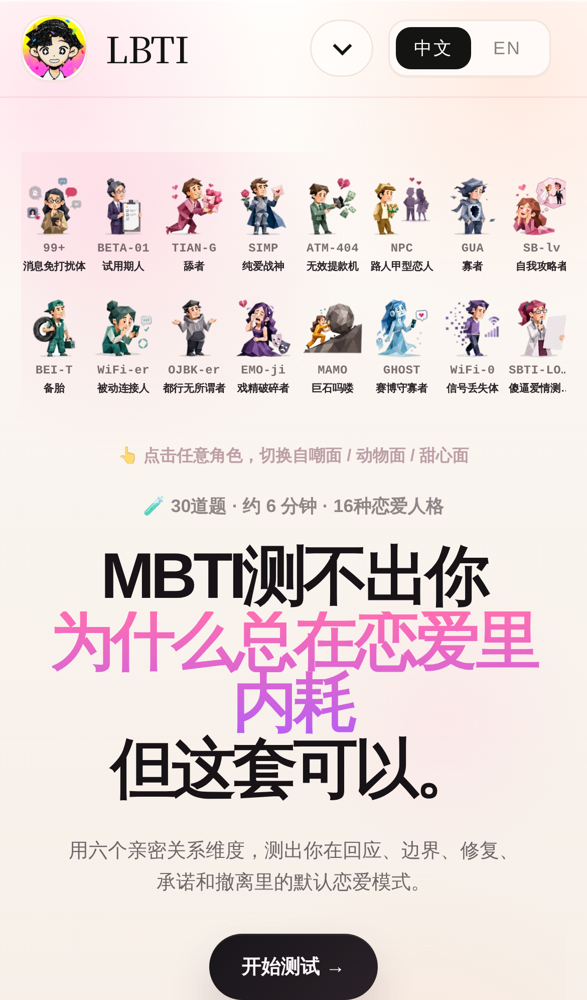
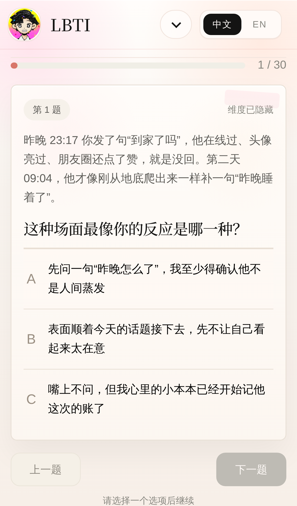
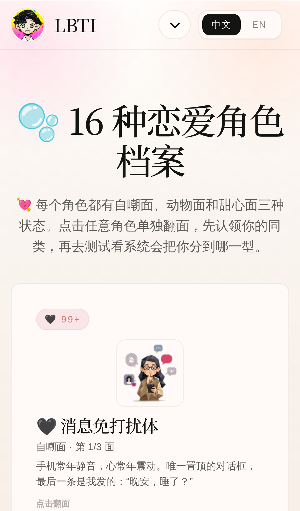
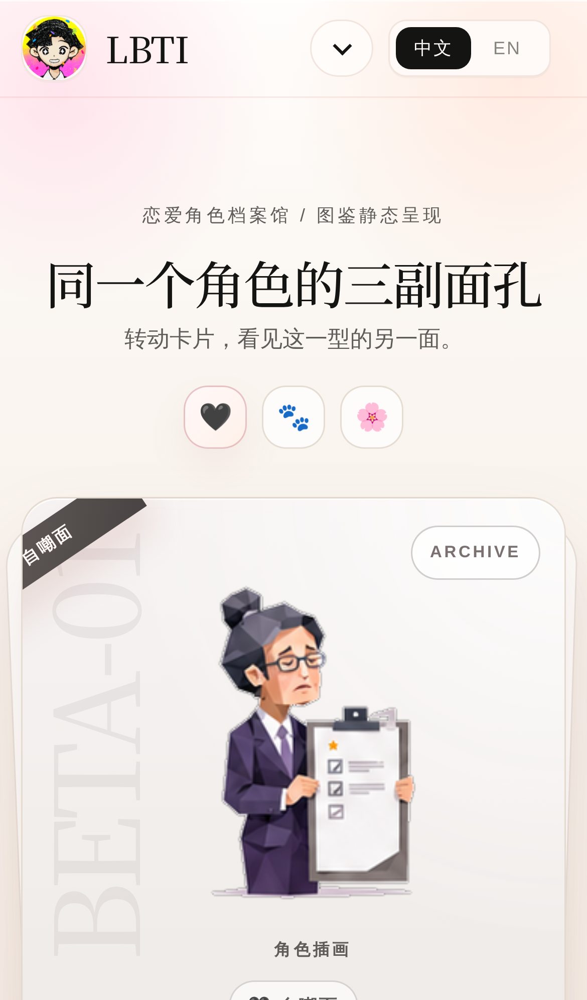

# AnyTI · LBTI Relationship Personality Platform

<p align="center">
  
</p>

> A mobile-first, shareable relationship personality test site with static deployment on GitHub Pages.

[](https://github.com/TobeMagic/AnyTI/actions/workflows/deploy.yml)
[](https://tobemagic.github.io/AnyTI/)
[](https://react.dev/)
[](https://vitejs.dev/)

Primary document: [中文 README](./README.md)

Quick links: [Live Site](https://tobemagic.github.io/AnyTI/) · [Quick Start](#quick-start) · [Screenshots](#screenshots)

## Table of Contents
- [Overview](#overview)
- [Online URLs](#online-urls)
- [Quick Start](#quick-start)
- [Commands](#commands)
- [Highlights](#highlights)
- [Screenshots](#screenshots)
- [Project Structure](#project-structure)
- [Portrait Pipeline](#portrait-pipeline)
- [Contributing](#contributing)
- [License](#license)

## Overview
AnyTI currently focuses on one polished channel: `LBTI`.

- 16-character matrix on homepage with 3 synchronized faces
- Mobile-friendly test flow
- Result poster generation for social sharing
- Fully static build and GitHub Pages deployment

## Online URLs

| Page | URL |
|---|---|
| Home | https://tobemagic.github.io/AnyTI/ |
| Test | https://tobemagic.github.io/AnyTI/test/ |
| Types | https://tobemagic.github.io/AnyTI/types/ |
| Type Detail (example) | https://tobemagic.github.io/AnyTI/types/plan-r/ |
| Repository | https://github.com/TobeMagic/AnyTI |

## Quick Start

```bash
git clone https://github.com/TobeMagic/AnyTI.git
cd AnyTI
npm ci
npm run dev
```

Open `http://localhost:5173/`.

## Commands

```bash
npm run dev         # local dev
npm run build       # validate + typecheck + build
npm run test        # unit tests
npm run test:e2e    # playwright tests
```

## Highlights

- `Three-face character system`: self-mock, animal, sweet
- `Shareable result card`: save and repost-ready output
- `Data-driven content`: `questions.json` + `personalities.json`
- `Auto deployment`: push to `main` and publish via GitHub Actions

## Screenshots

### Desktop

| Home | Test |
|---|---|
|  |  |

| Types | Type Detail |
|---|---|
|  |  |

### Mobile

| Home | Test |
|---|---|
|  |  |

| Types | Type Detail |
|---|---|
|  |  |

| Test Result (mobile) |
|---|
|  |

## Project Structure

```text
AnyTI/
├── content/tests/lbti/          # questions, personalities, metadata
├── public/images/lbti/          # runtime portrait assets
├── src/components/              # UI components
├── src/pages/                   # page-level components
├── src/lib/                     # scoring, routes, poster generation
├── src/styles/                  # global and page styles
├── scripts/                     # validation and crop scripts
└── .github/workflows/deploy.yml # GitHub Pages workflow
```

## Portrait Pipeline

Script:

- `scripts/crop_lbti_individual.py`

Outputs:

- `public/images/lbti/individual/self`
- `public/images/lbti/individual/animal`
- `public/images/lbti/individual/sweet`

## Contributing

1. Create a branch with focused commits.
2. Run `npm run build` before opening a PR.
3. Attach desktop + mobile screenshots for UI changes.
4. Describe scope, risk, and validation in PR notes.

## License

No explicit open-source license file is present yet (`LICENSE` not found). Add one before public redistribution.
